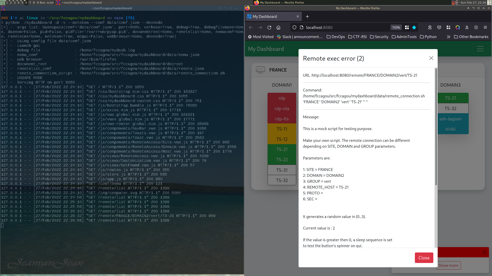

# Repository status

Master repo: https://gitlab.com/fccagou/mydashboard

# Quick run (but Unsafe way)

Run the microservice

    python ./mydashboard -d -v --notoken --conf data/conf.json

To make a user systemd servicea (still issue because of environment vars)

    mkdir -p ~/.config/systemd/user
    curl --silent http://localhost:8080/systemd/service -o ~/.config/systemd/user/mydashboard.service
    systemctl --user enable mydashboard
    systemctl --user start mydashboard

# Safe way 

In multi users environment, commands can be run by any connected user using
above commands. To avoid this security issue, remove the --notoken parameter.

Mydashboard will generate a token that must be pass as a cookie in every http
requests. This token is written in ~/.mydashboard file.

So, the token way to run mydashbard is :

    python ./mydashboard --d -v --conf data/conf.json

    curl  -b "MYTOKEN=$(cat ~/.mydashboard)" http://localhost:8080/doc
    curl  -b "MYTOKEN=$(cat ~/.mydashboard)" http://localhost:8080/ui

# Developement mode

To allow use of [VueJS devtools](https://devtools.vuejs.org/), add --devmode parameter
on your current command line.

/!\ You can only run this mode with the git repository. /!\

In unsafe way for example

    python ./mydashboard -d -v --notoken --devmode --conf data/conf.json

# The web GUI
## At startup

 "The web browser launched to access UI"

## Everything's OK
 "A valid remote access"

## Catch remote error
 "Remote error"

